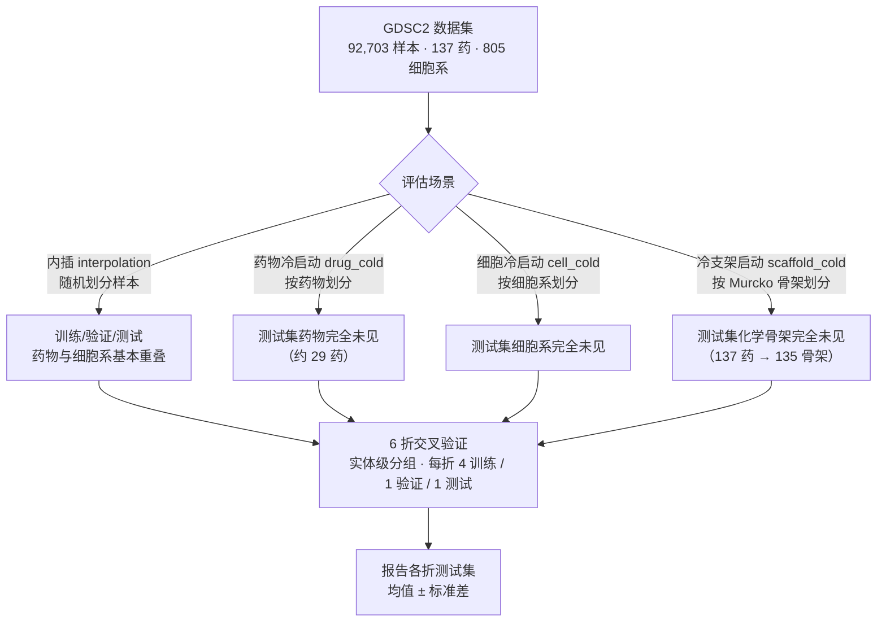
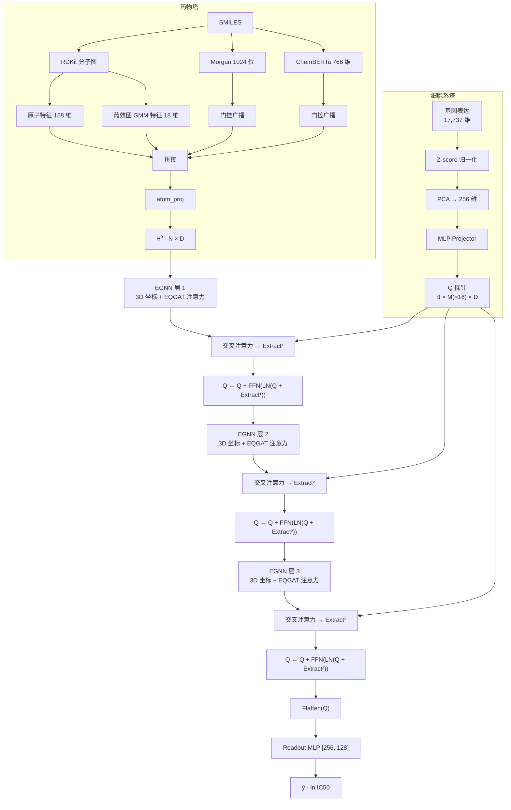
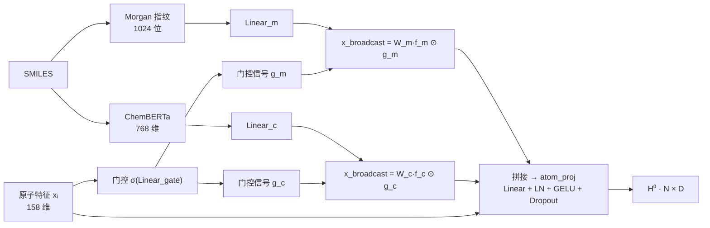
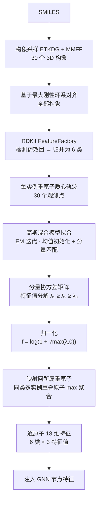
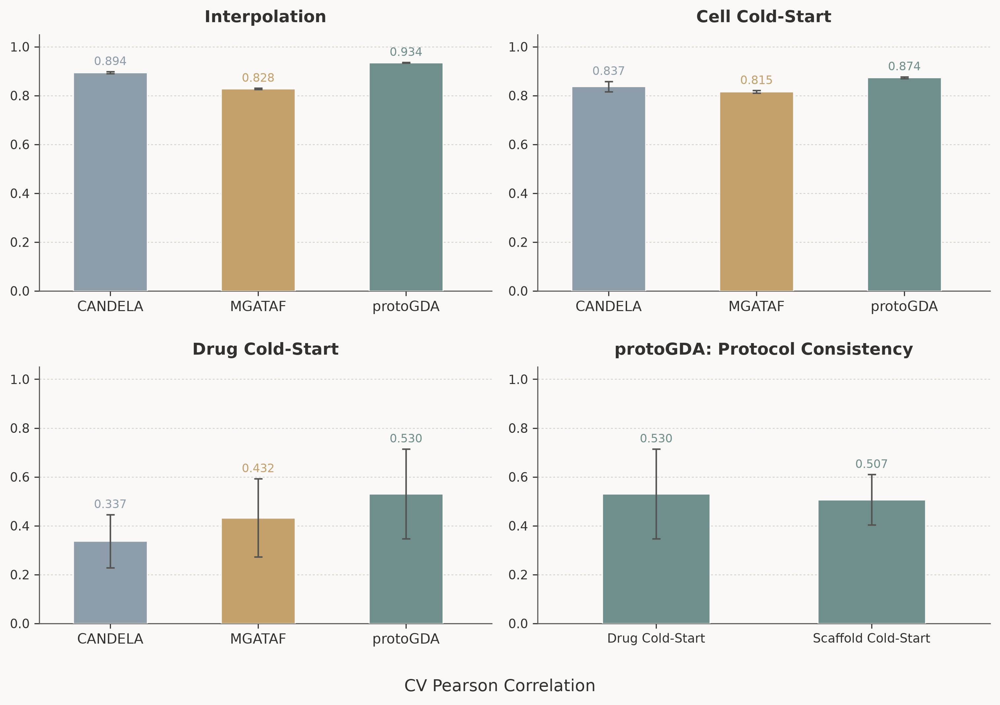

# 基于原子级预训练特征注入与高斯混合模型药效团模态的细胞系药物响应预测

**作者：** 郭知和（Zhihe Guo，通讯作者）
**单位：** 武汉大学
**通讯邮箱：** calamitias@whu.edu.cn
**ORCID：** https://orcid.org/0009-0000-0872-970X
**LLM 使用声明：** 本工作使用 DeepSeek 和 ChatGPT 辅助进行了广泛的代码实现。

---

## 摘要

### 背景

药物反应预测是实现精准医疗的重要手段，能够为患者个体筛选有效而副作用小的药物。尽管已有许多方案用于增强 CDR 模型的药物刻画能力，但现有方法并未刻画分子构象的重要作用，且模型的算法架构仍有进一步改进的空间。

### 结果

本研究提出了 protoGDA——一种融合高斯混合模型的多模态双塔图注意力网络。该方法通过引入高斯混合模型来描述药效团在空间中的分布，并调整了双塔架构和迁移学习特征的引入方式，以提升药物反应预测的准确性。该 GMM 模态仅需特征维度轻微增加，而不显著提升推理阶段的构象前向开销。使用 GDSC2 数据，在多种场景下对 protoGDA 进行评估以验证该模型的性能，并证明其在药物冷启动场景中的显著优势。进一步地，在独立测量批次 GDSC1 上的零样本跨数据集验证表明，模型对训练中完全未见药物的响应排序能力可跨库复现，其 pooled Pearson（0.520）与 GDSC2 内部分析（0.5305）几乎一致。

### 结论

实验证明，调整迁移学习特征的引入方式和高斯混合模型的引入能够显著提高 CDR 模型的药物反应预测能力。本文对比了多种 GNN 架构，并确定引入 EQGAT 等变图注意力增强的 EGNN 为最佳 GNN 架构。我们还通过实验验证，细胞系数据即使不进行内部训练，也可以保持相应性能。此外，在独立测量批次 GDSC1 上的零样本跨数据集验证进一步确认了上述结论的跨库稳健性。以上结果为设计构建更加高效准确的 CDR 模型提供了有效的借鉴，并提示了引入 GMM 以及更多有效特征的框架构建思路。

### 关键词

药物反应预测，迁移学习，高斯混合模型，肿瘤与癌细胞系，精准医疗，图神经网络

## 一、引言

​	肿瘤是重要的全球性公共卫生问题。其中，采用药物治疗（即化疗）已经成为标准的癌症治疗范式。但是，由于肿瘤的异质性和长期使用同种药物导致的耐药性，加之过往化疗药物往往具有较高的毒性，因而对毒性小、有针对性化疗药物的需求仍然十分迫切。为了筛选有希望成为化疗药物的分子，以癌细胞系作为响应平台进行药物筛选被广泛采用，并被证明有效[1,2]。尽管如此，对于广泛的分子和化学空间，采用湿实验方法实际测量每种化合物对数百种不同亚型癌细胞系的响应仍然成本不菲且耗时漫长。因此，采用深度学习模型预测癌细胞系对候选分子的响应成为有效的初筛方案。

​	细胞系药物响应任务（CDR）正是对上述问题的直接建模：给定药物分子与癌细胞系，预测药物对细胞系的药效响应。目前，采用药物-细胞系双塔模型进行训练逐渐成为 CDR 的主流架构，其中图神经网络（GNN）在药物侧的使用被证明能带来十分显著的性能提升[4]，在每层训练后以交叉注意力融合药物与细胞系表征亦可有效提升预测性能[26]，这被认为是因为交叉注意力能够刻画双方对彼此局部特征的针对性关联。为评估 CDR 模型的泛化能力，领域内普遍采用内插、细胞系冷启动与药物冷启动三种测试场景：现有模型在内插场景下已达到 0.93~0.95 的预测精度[6,7]，在此水平上进一步提升可能受限于药物反应数据自身的不一致性与噪声[8]；在细胞系冷启动场景下，模型通常仍能保持较好的预测性能[9]，这可能是因为细胞系特征空间分布与性质的相关性较好；但在药物冷启动场景下，大多数模型都会出现显著倒退[9]。因此，模型侧的建模目标应当是：在保持内插与细胞系冷启动预测能力的同时，尽可能提高药物冷启动场景下的预测能力。

​	为提高模型对分子性质的理解，研究者从药物表征与特征注入两个层面提出了多种方案。一类是多任务学习：在药物敏感性预测主任务之外联合分子性质回归、相似性网络重建等辅助任务，以增强对药物-细胞系关系的表征[27]，但这类方法对训练数据与计算资源的要求较高。另一类更普遍的是迁移学习：将在大规模化学空间上预训练的模型输出（如分子指纹、化学语言模型嵌入）作为药物侧特征输入 CDR 模型[9]。然而，在引入 GNN 的架构中，这些迁移特征往往在分子图离开 GNN 之后才与图表示拼接融合，未能参与图内消息传递，信息没有得到充分利用[4,9]。需要指出的是，无论多任务学习还是迁移学习，其增强对象都是分子既有的（多为二维或一维）表征，本身不产生任何三维构象信息；如何在药物侧表征中纳入构象柔性，是这类方法尚未触及的问题。

​	在化学信息学中，药效团（pharmacophore）指决定分子生物活性的特征基团在三维空间中的最优排列，是对分子如何与靶点发生作用的空间抽象，也是连接分子结构与下游活性的经典桥梁。将药效团语义引入深度学习分子表征，是近年来增强分子建模的另一条重要路线。RG-MPNN[29] 将分子表示为一棵保留药效团层级信息的约简图（reduced graph），在消息传递中逐步聚合药效团子结构，面向通用化学性质预测；MoGraphDRP[30] 则将分子分割为富含药效团语义的子结构并编码为指纹特征，用于增强细胞系药物反应预测。然而，这类方法将药效团作为固定的拓扑或二维子结构对象使用：既不刻画药效团位点在三维空间中的排布，也不反映分子柔性引起的药效团位点随构象变化而移动的特性，因而尚未触及药效团的构象层面信息。

​	要理解构象信息为何重要，需要回到药物作用的分子机制。药物靶点相互作用（drug–target interaction，DTI）预测药物分子与靶蛋白在分子层面的结合[3]，在化学原理上是 CDR 的上游建模：药物通过与靶蛋白结合、干扰信号通路进而抑制细胞生长，而结合强度与选择性取决于小分子以合适的结合构象与靶点活性位点形成三维互补。据此，分子构象是判断药物药效的第一性原理依据之一；药物从溶液构象系综到结合态生物活性构象的转变，直接决定其亲和力与选择性，进而影响细胞系响应这一下游表型。为在表征中纳入构象信息，分子机器学习与虚拟筛选研究开始采用多构象采样与注意力加权的方式，对同一分子的多个构象逐一编码并聚合[10]；这类显式方法能更全面地刻画分子柔性，但需要为每个分子枚举并前向计算多个构象，存储与推理开销显著[10]。相比之下，若能以紧凑的统计模型刻画构象空间的整体分布，就有望以远低于显式多构象的成本为模型补充柔性信息。

​	高斯混合模型（Gaussian Mixture Model，GMM）正是这样一种轻量级工具。GMM 以有限个高斯分量的加权和逼近任意复杂的连续分布，其概率密度为 $\Pr(\mathbf{x})=\sum_{k=1}^{K}\pi_k\mathcal{N}(\mathbf{x};\boldsymbol{\mu}_k,\boldsymbol{\Sigma}_k)$，其中 $\pi_k$、$\boldsymbol{\mu}_k$ 与 $\boldsymbol{\Sigma}_k$ 分别为第 $k$ 个分量的混合权重、均值向量与协方差矩阵；借助期望最大化（EM）算法[11]，GMM 可在无类别标注的条件下高效估计参数，以紧凑形式刻画多模态、各向异性的分布形态，因而被广泛用于各类连续数据的密度建模。在分子建模与药物设计领域，GMM 已有丰富应用：或以多个高斯分量表征分子构象集合在构象空间中的占有率分布[12]，或以高斯函数的叠加近似分子的电子密度与空间位阻信息[13,14]；在抗癌药物敏感性建模中，VADEERS[28] 亦将半监督 GMM 用作变分自编码器的潜在空间先验，服务于抗癌分子生成与敏感性预估。与显式枚举多构象并逐一前向计算的方式[10]相比，GMM 仅需少量参数即可描述构象空间的整体形态；对分量协方差矩阵做特征值分解得到的特征值天然具有旋转不变性，能以标量形式刻画位点在各方向上的伸展程度，几乎不引入额外推理开销。这些性质使 GMM 成为多构象显式建模的一种轻量级替代方案。然而，上述应用中的 GMM 或以整体构象密度、或以潜在生成空间为对象，尚没有工作将 GMM 用于刻画药物分子内药效团位点在构象集合上的空间分布，并将其作为判别式 CDR 模型的原子级输入特征。

​	综上，面向药物冷启动这一实际瓶颈，本文从构象维度提出一种低开销的分子柔性表征方案：以药效团位点跨构象的空间分布为对象，用 GMM 进行轻量级概率建模，并将协方差矩阵特征值作为旋转不变的原子级特征注入判别式双塔 CDR 模型。据我们所知，这是首个以药效团 GMM 作为原子级特征模态的双塔 CDR 工作。本文的主要贡献如下：

1. **原子级预训练特征门控广播**：改变预训练特征仅在 GNN 末端拼接的常见做法，训练原子感知门控机制，使每个原子从药物级 Morgan/ChemBERTa 特征中抽取个性化子空间特征，并进入图内消息传递；
2. **药效团 GMM 模态**：在预处理阶段从药物分子中选取药效团并采样构象，用 GMM 对药效团构象空间进行轻量级建模，将协方差矩阵特征值作为原子级旋转不变特征输入药物特征向量；
3. **轻量性与可扩展性**：与显式枚举多构象并逐一前向计算的方式相比，GMM 模态仅在离线预处理阶段引入额外开销，模型推理阶段无需增加构象前向次数，只需增加 18 维特征；
4. **系统验证与显著提升**：在 GDSC2 的内插、细胞系冷启动、药物冷启动与冷支架启动场景下进行系统评估，在保持内插和细胞系冷启动性能的同时，在药物冷启动场景取得显著性能提升；并在独立测量批次 GDSC1 上进行零样本跨数据集验证，确认对未见药物的响应排序能力可跨库复现。

---

## 二、数据与预处理

### 2.1 数据集

本工作使用 Therapeutics Data Commons（TDC）平台提供的 **GDSC2** 数据集[1,15]，包含 **92,703** 个药物–细胞系响应样本，覆盖 **137** 种药物与 **805** 种癌细胞系，标签为半数抑制浓度的自然对数（ln IC50）。药物侧与细胞系侧的唯一基础输入分别为 SMILES 分子结构与基因表达谱。

### 2.2 细胞系侧预处理

细胞系侧输入为 **17,737** 维 RMA 归一化基因表达谱。为避免数据泄漏，仅基于训练集细胞系估计 Z-score 归一化与主成分分析（PCA）的参数，随后将全部细胞系投影到 **256** 维空间，作为模型的实际输入特征。

### 2.3 药物侧预处理

首先使用 RDKit[25] 将 SMILES 解析为显式加氢的分子图，每个原子编码为 **158** 维特征（原子序数、度、形式电荷、手性、氢原子数、杂化方式、芳香性等 144 维基础特征以及氢键供体/受体、杂环、羰基、嘌呤/嘧啶骨架等 14 维扩展特征），每条化学键编码为 **6** 维特征（键型、共轭、成环）。构象敏感的模型变体（如 EGNN）额外加载 3D 构象。接着使用药物语言模型 ChemBERTa[16] 为每个 SMILES 生成 **768** 维嵌入，以及计算 **Morgan 圆形指纹**（ECFP[17]，半径 2，**1024** 位）。同时，从药物分子中筛选药效团并构建高斯混合模型（GMM）特征：对每个药物采样 **30** 个 3D 构象（ETKDG 嵌入与 MMFF 力场优化），基于最大刚性环系对齐全部构象以避免旋转带来的分布差异，用 RDKit FeatureFactory 检测药效团并归并为 **6** 类（氢键供体、氢键受体、芳香环、疏水、正电、负电），对每一类实例拟合 GMM，将各分量协方差矩阵的特征值归一化后映射回所属重原子，同类多实例重叠原子按 max 聚合，最终得到逐原子的 **18** 维特征（6 类 × 3 个特征值，详细定义见 4.4.2）。

### 2.4 数据划分

我们将在四种评估场景下对本架构进行测试。每种场景下均按照随机种子 42 划分训练集、验证集和测试集：

- **内插（interpolation）**：随机划分样本，训练/验证/测试集中药物与细胞系基本重叠；
- **药物冷启动（drug_cold）**：按药物种类随机划分，测试集药物完全未在训练中出现（约 29 个测试药物）；
- **细胞冷启动（cell_cold）**：按细胞系种类随机划分，测试集细胞系完全未在训练中出现；
- **冷支架启动（scaffold_cold）**：作为药物冷启动更加严格的分支场景出现。按药物的 Murcko 骨架[18]分组划分，测试集药物的化学骨架完全未在训练/验证集中出现（全库 137 药 → 135 骨架）。该协议参照 transCDR 的冷骨架划分方法[9]（`MurckoScaffoldSmiles`，保留手性），以评估模型对全新化学骨架的泛化能力，比药物冷启动更严格。

**图 1.** 数据划分与评估协议示意。四种场景下均采用实体级 6 折交叉验证。

---

## 四、方法

### 4.1 总体架构
如图 2 所示，预处理后的细胞系数据和药物数据分别送入两侧的塔中。细胞系数据经线性变换后生成一个静态的探针张量；药物数据经拼接融合后与探针张量进行交叉注意力（药物接受细胞系的查询），然后进入 GNN 中挖掘药物的深层化学信息，如此重复三次。最后一次离开 GNN 时，探针张量再次进行交叉注意力。随后，将探针张量展平送入读出层，得到最终的预测结果。

**图 2.** 整体模型架构。细胞系塔将基因表达谱投影为 $M=16$ 个探针查询 $\mathbf{Q}$；药物塔经 **EGNN**（等变图神经网络，含 3D 坐标演化与 EQGAT 等变图注意力）逐层演化原子特征（融合门控广播的预训练特征与药效团 GMM 特征）；每层探针以交叉注意力提取药物信息并以残差方式更新，最终展平送入读出 MLP 预测 $\ln$ IC50。

### 4.2 任务定义

给定药物分子 $d$ 与癌细胞系 $c$，预测其响应值 $\hat{y} \in \mathbb{R}$（对数 IC50）。记药物图 $\mathcal{G}_d = (\mathcal{V}, \mathcal{E})$，其中节点 $v_i \in \mathcal{V}$ 为原子、边 $e_{ij} \in \mathcal{E}$ 为化学键；细胞系特征向量为 $\mathbf{f}_c \in \mathbb{R}^{256}$。目标是构建一个深度学习网络，通过 $d$ 与 $c$ 预测响应值 $\hat{y}$：

$$\hat{y} = f_{\theta}(d, c),$$

其中 $f_{\theta}$ 为待学习的深度网络，由药物塔与细胞系塔构成。

### 4.3 细胞系塔（探针投影）

基因表达向量经 MLP（LayerNorm / GELU / Dropout）与一组可学习探针偏置，投影为 $\mathbf{Q} \in \mathbb{R}^{B \times M \times D}$。共使用 $M=16$ 个探针，用于表征不同的生物学通路偏好。$\mathbf{Q}$ 投影后将跨层复用，且不进行细胞塔内部的逐层训练。

### 4.4 药物塔（图演化）

原子特征（158 维）与原子级门控广播后的 Morgan/ChemBERTa 特征（各 32 维）以及药效团 GMM 特征（18 维）拼接，经 `atom_proj`（Linear + LayerNorm + GELU + Dropout）投影到隐藏维 $D$。以下分别介绍两种原子级特征注入机制与图演化算子。

#### 4.4.1 原子级预训练特征注入

区别于"将预训练向量拼接在 GNN 输出后"的常见做法[4,9]，我们训练一个**原子感知的门控机制**，让每个原子从药物级预训练特征中提取属于自己的子信息：

$$\mathbf{g}_{\text{m}} = \sigma(\text{Linear}_{\text{gate}}(\mathbf{x}_{\text{atom}})),$$

$$\mathbf{x}^{\text{broadcast}}_i = \mathbf{W}_{\text{m}}(\mathbf{f}_{\text{morgan}}) \odot \mathbf{g}_{\text{m}}(\mathbf{x}_i),$$

其中 $\mathbf{x}_i$ 为原子 $i$ 的 158 维特征，$\mathbf{f}_{\text{morgan}}$ 为药物级 Morgan 向量，$\odot$ 为逐元素乘。ChemBERTa 向量以相同方式注入。该机制使不同化学环境的原子从同一药物级向量中"抽取"不同信息，随后与原子特征拼接送入投影层，使预训练信息进入图内消息传递，而非仅在末端拼接。

**图 3.** 原子级预训练特征注入。每个原子通过门控信号从药物级 Morgan / ChemBERTa 向量中抽取个性化子空间特征，再与原子特征拼接送入投影层。

#### 4.4.2 药效团 GMM 模态

设第 $k$ 个药效团实例在 $C=30$ 个对齐构象中的重原子质心坐标为 $\{\mathbf{p}_k^{(1)}, \dots, \mathbf{p}_k^{(C)}\} \subset \mathbb{R}^3$。对同一类药效团的所有实例，拟合高斯混合模型：

$$\Pr(\mathbf{p}) = \sum_{k=1}^{K} \pi_k\, \mathcal{N}(\mathbf{p}; \boldsymbol{\mu}_k, \boldsymbol{\Sigma}_k),$$

式中 $K$ 为同一类药效团的实例总数，$\pi_k$、$\boldsymbol{\mu}_k$ 与 $\boldsymbol{\Sigma}_k$ 分别为第 $k$ 个分量（对应第 $k$ 个实例）的混合权重、均值向量与协方差矩阵。由于不同实例在空间中可能彼此邻近，其质心点云相互重叠，每个观测点 $\mathbf{p}$ 究竟源自哪个实例是未知的，这构成含隐变量的不完全数据问题。若直接对观测对数似然 $\sum_i \log \sum_k \pi_k \mathcal{N}(\mathbf{p}_i; \boldsymbol{\mu}_k, \boldsymbol{\Sigma}_k)$ 求导，对数内仍含求和，无法得到闭式解；EM 算法通过引入归属隐变量并交替执行 E 步与 M 步求解该问题[11]。

**E 步（期望步）**：在给定当前参数 $\{\pi_k^{(t)}, \boldsymbol{\mu}_k^{(t)}, \boldsymbol{\Sigma}_k^{(t)}\}$ 时，计算每个观测点 $\mathbf{p}_i$ 属于第 $k$ 个分量的后验概率（责任）：

$$\gamma_{ik}^{(t)} = \frac{\pi_k^{(t)}\, \mathcal{N}(\mathbf{p}_i; \boldsymbol{\mu}_k^{(t)}, \boldsymbol{\Sigma}_k^{(t)})}{\sum_{j=1}^{K} \pi_j^{(t)}\, \mathcal{N}(\mathbf{p}_i; \boldsymbol{\mu}_j^{(t)}, \boldsymbol{\Sigma}_j^{(t)})},$$

其刻画第 $i$ 个质心观测对第 $k$ 个实例的软归属强度——点距某个分量的马氏距离越小，责任越大，但并非硬划分。

**M 步（最大化步）**：以责任 $\gamma_{ik}^{(t)}$ 为权重，对各分量参数作加权最大似然估计：

$$\pi_k^{(t+1)} = \frac{\sum_{i=1}^{N} \gamma_{ik}^{(t)}}{N}, \qquad
\boldsymbol{\mu}_k^{(t+1)} = \frac{\sum_{i=1}^{N} \gamma_{ik}^{(t)} \mathbf{p}_i}{\sum_{i=1}^{N} \gamma_{ik}^{(t)}},$$

$$\boldsymbol{\Sigma}_k^{(t+1)} = \frac{\sum_{i=1}^{N} \gamma_{ik}^{(t)} (\mathbf{p}_i - \boldsymbol{\mu}_k^{(t+1)})(\mathbf{p}_i - \boldsymbol{\mu}_k^{(t+1)})^\top}{\sum_{i=1}^{N} \gamma_{ik}^{(t)}} + \varepsilon \mathbf{I},$$

式中 $N = K \cdot C$ 为全部观测点总数，$\varepsilon \mathbf{I}$ 为对角脊正则项，用以保证协方差矩阵可逆。E 步与 M 步交替迭代，每一步均保证观测对数似然单调不减，直至变化量低于阈值或达到最大迭代次数。由于 $K$ 等于实例数且维度仅 3，并以各实例参考质心 $\frac{1}{C}\sum_{c=1}^{C}\mathbf{p}_k^{(c)}$ 初始化分量均值，EM 通常在数十次迭代内收敛。此外，为避免迭代中分量标签漂移导致的重排序，收敛后按分量均值与初始化均值的最近距离将分量贪心地匹配回原实例，确保特征值与实例一一对应。对每个分量协方差做特征值分解 $\boldsymbol{\Sigma}_k = \mathbf{U}_k \text{diag}(\lambda_{k1},\lambda_{k2},\lambda_{k3}) \mathbf{U}_k^\top$，取特征值并归一化：

$$\mathbf{g}_k = \log\big(1 + \sqrt{\max(\lambda_{k1}, 0)}\big),\ \log\big(1 + \sqrt{\max(\lambda_{k2}, 0)}\big),\ \log\big(1 + \sqrt{\max(\lambda_{k3}, 0)}\big).$$

特征值刻画了该药效团位点在构象空间中的柔性/展开程度（刚性环系特征值小，柔性侧链特征值大），以旋转不变的标量形式逐原子注入节点特征，在不破坏图网络等变性质的前提下，用微小维度代价（6 类 × 3 = 18 维）编码多构象信息。

**图 4.** 药效团 GMM 模态预计算管线。从 SMILES 出发经构象采样、对齐、药效团检测、GMM 拟合与特征值分解，得到逐原子的 18 维柔性特征。

#### 4.4.3 EGNN 等变卷积与 EQGAT 等变图注意力

每层使用 **EGNN**（等变图神经网络）卷积[19]：消息传递同时更新隐藏特征 $\mathbf{h}$ 与 3D 坐标 $\mathbf{x}$（键长/角度等旋转不变距离信息经饱和 RBF 编码），并在消息聚合中加入**等变图注意力（EQGAT）**[24]（内容和空间相关的注意力滤波，softmax 邻居加权，保持 E(n) 等变性），经 LayerNorm / GELU / Dropout / 残差连接演化节点特征。

### 4.5 逐层交叉注意力与残差交互

模型采用双塔 + 逐层交叉注意力框架。细胞系塔将 $\mathbf{f}_c$ 投影为一组 $M$ 个可学习的探针查询 $\mathbf{Q} \in \mathbb{R}^{M \times D}$；药物塔经 GNN 逐层演化原子特征 $\mathbf{H}^{(l)}$。在每一层，探针以单向交叉注意力从当前药物图节点中提取与细胞相关的信息，并沿层累积更新：

$$Q^{(l+1)} = Q^{(l)} + \text{FFN}\big(\text{LN}(Q^{(l)} + \text{Extract}^{(l)})\big),$$

其中 $\text{Extract}^{(l)}$ 为该层多头交叉注意力的提取结果：

$$\mathbf{Q} = \text{Linear}_Q(\mathbf{Q}),\quad \mathbf{K} = \text{Linear}_K(\mathbf{H}^{(l)}),\quad \mathbf{V} = \text{Linear}_V(\mathbf{H}^{(l)}),$$

$$\text{Attn}(\mathbf{Q}_i, \mathbf{K}_i, \mathbf{V}_i) = \text{softmax}\!\left(\frac{\mathbf{Q}_i \mathbf{K}_i^\top}{\sqrt{d_h}}\right) \mathbf{V}_i,$$

其中下标 $i$ 表示逐样本计算（各分子原子数不同，对批内序列做填充对齐），输出维度仅由探针数 $M$ 与隐藏维度 $D$ 决定，与分子大小无关。经过全部 $L=3$ 层后，将探针展平送入读出 MLP（隐藏层 [256, 128]）输出预测。

### 4.6 训练细节

Adam 优化器，初始学习率 $10^{-4}$，权重衰减 $10^{-4}$，学习率预热 5 轮 + ReduceLROnPlateau 调度，批大小 1280，均方误差损失。为缓解药物冷启动下对训练药物的记忆，药物侧启用正则化（原子投影 Dropout 0.3、Morgan/ChemBERTa 投影高斯噪声 $\sigma=0.3$）。各场景六折交叉验证的训练轮数依据早停验证轮数设定：内插 200 epoch、细胞冷启动 100 epoch、药物冷启动与冷支架启动 60 epoch。

### 4.7 评估指标

本文采用 **Pearson 相关系数**与**均方根误差（RMSE）**作为主要评估指标。Pearson 相关系数度量模型预测与真实响应之间的线性相关程度，RMSE 度量预测的平均偏差。在 6 折交叉验证协议下，主要报告各折测试集指标的均值 ± 标准差；对样本量充足的场景（内插、细胞冷启动），各折测试集包含全部药物，逐折指标稳定，均值即能反映整体水平。对于实体级分裂（药物冷启动、冷支架启动），各折测试集仅包含约 23 个药物/骨架，逐折 Pearson 对测试药物的采样高度敏感、折间波动较大，结果解读需结合折间标准差。

此外，采用 6 折交叉验证作为正式评估协议。对每个场景，按药物（drug_cold / scaffold_cold）或细胞系（cell_cold）或样本（interpolation）分组做实体级 6 折，每折以 4 折训练、1 折验证、1 折测试，报告各折测试集的均值 ± 标准差。

### 4.8 LLM 使用声明

本研究使用 DeepSeek 和 ChatGPT 辅助进行了广泛的代码实现、调试与实验脚本编写。所有模型设计、数据分析与结论撰写由作者完成并对其负责。

---

## 五、结果

​	我们对 protoGDA 的训练超参数进行了基于实验的调优。结果表明，药物侧正则化对训练收敛产生了显著影响：在药物冷启动场景中，采用合适的正则化参数（原子投影 Dropout 0.3）可以让原本无法收敛的模型恢复收敛。训练过程中，内插、细胞系冷启动与药物冷启动模型的验证损失分别约在 130、100 与 60 epoch 内停止改善，各场景的正式训练轮数设定见 4.6。

​	在内插、细胞系冷启动、药物冷启动和冷支架启动四个场景下对 protoGDA 进行测试。结果显示，protoGDA 在内插场景取得 0.9344 ± 0.0016 的 CV Pearson，在细胞系冷启动场景取得 0.8735 ± 0.0036；在固定训练与确定性划分的药物实体级对照中，drug_cold 与 scaffold_cold 分别取得 0.5305 ± 0.1842 与 0.5067 ± 0.1035。

### 5.1 总体对比

​	将 protoGDA 与 CANDELA[5]、MGATAF[6] 等模型在三个独立主基准（内插、细胞冷启动、药物冷启动）进行对比，结果如表 1 所示。在内插场景下，protoGDA 的 CV Pearson 为 0.9344，高于 CANDELA（0.8945）与 MGATAF（0.8278）；在细胞冷启动场景下为 0.8735，高于 CANDELA（0.8372）与 MGATAF（0.8152）；在药物冷启动场景下为 0.5305，高于 CANDELA（0.3370）与 MGATAF（0.4325）。药物冷启动列基于与表 2 相同的确定性 60ep 协议（固定划分、每折固定种子、验证 Pearson 选 checkpoint），确保主模型与基线的数值口径一致。

**表 1.** 各模型在三个独立主基准上的测试集表现（Pearson 相关系数 / RMSE）。除特别标注外，全部数值为 6 折交叉验证的均值 ± 标准差；MGATAF 文献为原论文报告值[6]。

| 模型 | 内插 Pearson | 内插 RMSE | 细胞冷启动 Pearson | 药物冷启动 Pearson | 药物冷启动 RMSE |
|------|:---:|:---:|:---:|:---:|:---:|
| CANDELA（CV） | 0.8945 ± 0.0039 | 1.2184 ± 0.0183 | 0.8372 ± 0.0209 | 0.3370 ± 0.1089 | 2.7079 ± 0.2898 |
| MGATAF（CV） | 0.8278 ± 0.0024 | 1.5275 ± 0.0091 | 0.8152 ± 0.0053 | 0.4325 ± 0.1603 | 2.6335 ± 0.3420 |
| MGATAF（文献） | 0.9312 | 0.0225† | 0.8536 | — | — |
| **protoGDA (EGNN + 自注意力 + GMM)（CV）** | **0.9344 ± 0.0016** | **0.9743 ± 0.0122** | **0.8735 ± 0.0036** | **0.5305 ± 0.1842** | **2.2931 ± 0.2978** |

† 文献 RMSE 基于归一化标签，仅作趋势参考。
" — " 表示未运行/未报告。

> 注 1：CANDELA[5] / MGATAF[6] 为忠实复现的公开基线（GATv2[23] 图编码、多通道注意力等），图特征为文献规定的 78 维原子特征；protoGDA 各行为本工作同口径 CV 实测结果。CV 每折训练数据少于单次满数据训练，所有模型在同一 CV 协议下比较。

表 2 进一步汇总本模型在各评估场景下的完整指标。对于药物冷启动与冷支架启动，更新后的确定性 6 折结果显示两种协议的表现接近：Pearson 分别为 0.5305 ± 0.1842 与 0.5067 ± 0.1035。

**表 2.** protoGDA 在四种评估场景下的完整评估指标。

| 场景 | CV Pearson（均值 ± 标准差） | RMSE |
|------|:---:|:---:|
| 内插（200ep） | 0.9344 ± 0.0016 | 0.9743 ± 0.0122 |
| 细胞冷启动（100ep） | 0.8735 ± 0.0036 | 1.3473 ± 0.0310 |
| 药物冷启动（60ep） | 0.5305 ± 0.1842 | 2.2931 ± 0.2978 |
| 冷支架启动（60ep） | 0.5067 ± 0.1035 | 2.2889 ± 0.4270 |

> 药物冷启动与冷支架启动行均采用固定划分、固定每折随机种子、验证 Pearson 选 checkpoint 的 60ep 6 折协议。

GDSC2 中 137 个药物仅对应 135 个 Murcko 骨架，其中 **133 个骨架只含一个药物**，因此冷支架协议在药物实体层面与 drug_cold 基本等价。本文仅将冷支架协议作为本架构内部的协议一致性对照，而不用于跨模型排名。表 2 中两种协议的 Pearson 差异仅为 0.024，也说明该数据集不足以将骨架约束解释为独立于药物冷启动的额外难度。

​	进一步观察三个独立主基准上的模型差距，可以得到几点结论。在内插场景下，protoGDA 达到 0.9344 ± 0.0016，接近该数据集的合理性能上限，较 CANDELA（0.8945）高 0.040，较 MGATAF（0.8278）高 0.107，与 MGATAF 文献最优水平（0.9312）持平。在细胞冷启动场景下，protoGDA 取得 0.8735 ± 0.0036，仍保持领先，超过 CANDELA（0.8372）与 MGATAF（0.8152）约 0.036 与 0.058。在药物冷启动场景下，protoGDA 的优势进一步扩大，以 0.5305 ± 0.1842 的 CV Pearson 超过 CANDELA（0.3370）约 0.194、超过 MGATAF（0.4325）约 0.098，RMSE 也由 CANDELA 的 2.7079 与 MGATAF 的 2.6335 降至 2.2931，说明本架构在未见药物上的泛化能力具有优势。

**图 5.** 左上至右下前三个子图比较三种模型在内插、细胞冷启动和药物冷启动主基准上的 CV Pearson（均值 ± 标准差）；右下子图仅比较 protoGDA 在 drug_cold 与 scaffold_cold 下的结果，不作跨模型冷支架排名。

### 5.2 计算开销对比

为考察 protoGDA 轻量级构象建模的代价，我们在同一硬件上比较了三种模型的可训练参数量与单次前向推理时延，结果如表 3 所示。protoGDA 的可训练参数为 **90.8 万**，分别仅为 CANDELA（168.4 万）的 54% 与 MGATAF（368.4 万）的 25%；其中药效团 GMM 模态本身的边际参数开销仅为 **1,152**（占模型总参数 0.13%），对应图 2 中逐原子特征维度仅增加 18 维的原子级投影。在批量前向推理时延上，三模型处于同一量级（单样本 41–142 μs，单张 NVIDIA RTX 4090，batch size 256），protoGDA 略高于两个基线，这源于其药物塔在每层执行 3D 坐标演化与 EQGAT 等变注意力，并逐原子门控广播两组预训练特征；作为回报，protoGDA 以最小的参数量取得最高的 drug_cold 精度（表 1）。需要强调的是，GMM 模态的全部构象采样与拟合均在离线预处理阶段完成，推理阶段不引入任何额外的构象前向计算——与需要推理时显式前向多个构象的方案（如 30 构象逐一计算）相比，protoGDA 的推理成本不随构象数目增长。

**表 3.** 三模型计算开销对比。参数量为可训练参数总数；推理时延为单张 NVIDIA RTX 4090 上 batch size = 256 的平均单次前向耗时（mean ± std，40 次重复），并折算为单样本时延。

| 模型 | 可训练参数量 | 推理时延（ms/批） | 单样本（μs） |
|---|---:|---:|---:|
| protoGDA | 907,795 | 36.37 ± 1.81 | 142.1 |
| CANDELA | 1,684,101 | 15.65 ± 0.36 | 61.1 |
| MGATAF | 3,684,357 | 10.62 ± 0.32 | 41.5 |

### 5.3 跨数据集泛化验证（GDSC1 零样本）

​	同库划分上的评估仍不能完全排除记忆化。为检验模型在完全未见药物上的跨数据集泛化，我们引入 GDSC 的独立早期测量版本 GDSC1 作为外部批次。GDSC1 与 GDSC2 由不同实验批次与剂量方案测得，两者共享 62 个药物（按规范 SMILES 匹配）与 803 个细胞系，但响应绝对值存在系统性的批次尺度差异，因此外部验证采用尺度无关的 Pearson 相关作为指标。对每个共享药物，我们取 drug_cold v3 六折中以该药物为测试药物、即**训练中完全未见该药物**的那一折 checkpoint，对其在该药物于 GDSC1 上的全部响应做零样本预测；全部 62 个 held-out 药物共覆盖 46,993 对。

​	结果如表 4 所示。protoGDA 的 pooled Pearson 为 **0.520**，与其在 GDSC2 内部 drug_cold 协议下的 CV Pearson（0.5305）几乎一致，表明模型在新药响应排序上的能力可以跨独立测量批次复现，而非依赖对 GDSC2 特定批次的记忆；该值显著高于 MGATAF（0.402）与 CANDELA（0.198）。在药物级聚合（每药物对全部共享细胞系取平均响应）后，protoGDA 的相关为 0.578，同样领先于 MGATAF（0.436）与 CANDELA（0.172）。值得注意的是，三模型的逐药内部 Pearson（单药内跨共享细胞系的排序能力）处于相近水平（均值 0.27–0.29），提示在该共享细胞系规模下，细胞系间的相对排序已接近可观测的一致性上限；跨库差异主要来自药物侧表征的泛化质量，这与 4.6 中"能力瓶颈在药物侧"的结论相互印证。

**表 4.** GDSC1 零样本跨数据集验证（62 个 held-out 共享药物 × 803 共享细胞系，共 46,993 对）。每个药物的预测均来自 drug_cold v3 六折中以该药物为测试药物的 checkpoint（训练阶段从未见过该药）。GDSC1 与 GDSC2 的响应绝对值存在批次尺度差异，故仅报告尺度无关的 Pearson 相关。

| 模型 | pooled Pearson | drug-level Pearson |
|---|:---:|:---:|
| CANDELA | 0.198 | 0.172 |
| MGATAF | 0.402 | 0.436 |
| **protoGDA** | **0.520** | **0.578** |

---

## 六、消融实验

全部消融均采用与第五章正式结果**同口径的 60 epoch、6 折交叉验证协议**（实体级分组、每折 4 训练 / 1 验证 / 1 测试、报告各折测试集 Pearson 均值 ± 标准差），与 5.1 表直接可比。

### 6.1 不同 GNN 承载架构 × 药效团模态

​	为探究最合适的 GNN 承载架构，我们对 GAT[20]、GINE[21,22]、EGNN[19] 三种架构在有无药效团（GMM）模态下的 drug_cold 性能进行了对比，结果如表 5 所示。GMM 特征的加入提升了 GINE（0.496→0.512）与 EGNN（0.497→0.507）的性能，但导致 GAT 的性能下降（0.506→0.436）。为考察 GAT 性能下降的原因，我们还引入了 18 维全零特征与 18 维噪声特征的对比试验：加入全零特征的 GAT 同样出现显著下降，而加入噪声特征的 GAT 与原始 GAT 几乎无差异。此外，在 GAT 上以残差方式注入 GMM 特征并补充键特征语境后，其 drug_cold Pearson 回升至 0.506 ± 0.147，说明键/三维语境对消费药效团特征具有重要作用。进一步地，我们在 EGNN 中引入 EQGAT 等变图注意力变体，其 drug_cold Pearson 提升至 0.531 ± 0.146，且折间方差较无注意力版本（0.507 ± 0.178）更小。相关机理分析见 7.2。

**表 5.** drug_cold 场景下不同 GNN 承载架构 × 药效团模态的测试集 Pearson（60ep 6 折 CV 的均值 ± 标准差）。

| GNN 类型 | 无药效团 | + 药效团（GMM） |
|---|:---:|:---:|
| GAT（无 edge_attr） | 0.506 ± 0.178 | 0.436 ± 0.258 |
| GAT（残差注入 + 键特征语境） | — | 0.506 ± 0.147 |
| GINE（含 edge_attr） | 0.496 ± 0.169 | 0.512 ± 0.176 |
| EGNN（含 3D 坐标，无自注意力） | 0.497 ± 0.156 | 0.507 ± 0.178 |
| **EGNN（含 3D 坐标，+ 自注意力）** | — | **0.531 ± 0.146** |

> EGNN + 自注意力且无药效团的组合未单独运行——自注意力与药效团为相互独立的配置开关（`egnn_use_attention` / `use_pharmacophore`），本表如实报告正式采用的组合（见 4.4.3）。

### 6.2 高斯混合模型 vs 经验协方差

​	经验协方差可以视为高斯混合模型在"药效团实例与 GMM 分量对应关系已确定"情况下的特例：采用经验协方差时，可直接将各实例的协方差赋给对应分量，而不经 EM 进行概率分配。我们在药物冷启动场景下对比了两种思路，结果如表 6 所示。两种方式的 drug_cold Pearson 分别为 0.531 ± 0.146 与 0.504 ± 0.164，差异为 0.027，处于折间噪声范围；GMM 数值上略优，故本文采用 GMM 作为正式方案。该差异的可能成因见 7.3。

**表 6.** drug_cold 场景（60ep 6 折 CV）下两种协方差估计方式的 Pearson 相关系数（均值 ± 标准差）。

| 协方差估计方式 | drug_cold Pearson |
|---|:---:|
| 每实例经验协方差 | 0.504 ± 0.164 |
| **GMM（EM 拟合分量协方差）** | **0.531 ± 0.146** |

### 6.3 药效团特征引入方式

​	我们进一步探究了 GMM 特征的引入方式，结果如表 7 所示。以残差注入方式将 GMM 特征绕过共享 LayerNorm 直接加入分子图，其 drug_cold Pearson（0.473 ± 0.205）低于默认的拼接进原子特征方式（0.531 ± 0.146），差异为 0.058。相关分析见 7.3。

**表 7.** drug_cold 场景（60ep 6 折 CV）下 GMM 特征不同引入方式的 Pearson 相关系数（均值 ± 标准差）。

| 引入方式 | drug_cold Pearson |
|---|:---:|
| **拼接进原子特征（默认）** | **0.531 ± 0.146** |
| 残差注入（绕过 LayerNorm） | 0.473 ± 0.205 |

### 6.4 预训练特征引入位置

​	为验证前置预训练特征引入的设计，我们在最终基底（EGNN + 自注意力 + GMM）上，以 drug_cold 60ep 6 折 CV 同口径对比了两种预训练特征引入方式，结果如表 8 所示。在分子图离开 GNN 后再将预训练特征拼接的末端拼接方式，其 Pearson 为 0.488 ± 0.165，较原子级门控广播低 0.043。该消融与 5.1 主表、6.1 完全同口径，可直接比较。相关分析见 7.3。

**表 8.** drug_cold 场景（60ep 6 折 CV）下预训练特征引入位置的测试集 Pearson 均值 ± 标准差。

| 引入方式 | drug_cold Pearson |
|---|:---:|
| **原子级门控广播（默认）** | **0.531 ± 0.146** |
| 末端拼接（late concat） | 0.488 ± 0.165 |

### 6.5 细胞塔是否需要内部训练

​	为考察取消细胞塔内部训练的合理性，我们在每层交叉注意力之前对细胞探针施加塔内训练块（自注意力 + FFN，Pre-LN 残差结构，3 层、8 头），结果如表 9 所示。在内插与细胞冷启动场景下，塔内运算相较于基底无明显差异；在药物冷启动场景下则出现明显下降（0.531 → 0.410，Δ = -0.121）。相关讨论见 7.4。

**表 9.** 三个场景下有无塔内训练的 Pearson 相关系数（60ep 6 折 CV，均值 ± 标准差）。

| 场景 | 无塔内（基底） | + 塔内训练 | Δ |
|------|:---:|:---:|:---:|
| drug_cold | **0.531 ± 0.146** | 0.410 ± 0.196 | -0.121 |
| interpolation | **0.9344 ± 0.0016** | 0.9321 ± 0.0023 | -0.002 |
| cell_cold | **0.8735 ± 0.0036** | 0.8717 ± 0.0058 | -0.002 |

---

## 七、讨论

### 7.1 主要结论

本文围绕细胞系药物响应预测中药物冷启动泛化这一核心问题，提出原子级预训练特征注入以及引入高斯混合模型两项改进，并以系统实验验证。实验结果表明，在内插和细胞冷启动场景下，本工作均取得全部模型中最优的 CV Pearson（内插 0.9344、细胞冷启动 0.8735），与文献最优水平持平或略优；在药物冷启动场景下，本工作以 0.5305 显著领先全部复现基线（CANDELA 0.3370、MGATAF 0.4325），RMSE 同步下降，验证了引入 GMM 刻画构象空间柔性对未见药物泛化的价值。

消融实验进一步给出了几点明确结论。首先，承载架构与消息注意力是药效团模态能否发挥作用的先决条件：EGNN 消息内 EQGAT 注意力在 60 epoch 6 折 CV 下显著优于无注意力版本（drug_cold 0.531 vs 0.456），而早期 25 epoch 短训练口径下反而更差，说明充分训练是注意力机制发挥作用的必要条件，这一发现修正了此前"EGNN 自注意力无效"的结论。其次，细胞塔的静态设计是充分的：在层间对探针叠加塔内训练块在内插与细胞冷启动场景下基本持平（Δ ≈ -0.002），而在药物冷启动场景下反而明显下降（Δ = -0.121），印证了模型的能力瓶颈在药物侧而非细胞塔容量，"细胞塔负责提供稳定的查询初始化、药物塔负责逐层信息演化"的架构分工合理且高效。再次，原子级门控广播较末端拼接高 0.043（drug_cold 0.531 vs 0.488），从机理上支撑了让预训练特征进入图内消息传递的设计。此外，GMM 与经验协方差性能相当，印证了以 GMM 形式呈现多构象信息的合理性。

### 7.2 承载架构与药效团模态的相互作用

药效团 GMM 特征对承载架构高度敏感。GAT 携带药效团后性能显著受损（0.506→0.436），其原因来自两方面。其一，GMM 特征只提取重原子的药效团信息，18 维特征的非零位点很少、呈稀疏的零/非零模式；全零特征对照试验重现了同样的性能下降，而噪声特征几乎无影响，说明 GAT 的注意力路由会将这种稀疏模式误当作原子身份信号。其二，基础 GAT 缺少消费三维特征的语境——当采用显式消费键/三维特征的架构（GINE、EGNN）时，药效团特征转为正贡献；表 5 中 GAT 以残差注入补充键特征语境后，其 drug_cold Pearson 回升至 0.506 ± 0.147，进一步印证了键/三维语境对消费药效团特征的必要性；EGNN 加入消息内自注意力后，可学习的邻居加权使模型能更精准地消费药效团柔性特征，达到全部配置最高水平（0.531）。因此，承载架构与消息注意力是药效团模态能否发挥作用的先决条件，这也是我们将 EGNN + 自注意力作为基底的原因。此外，自注意力机制需要充分训练才能发挥作用：在 60 epoch 完整训练下其优势才得以显现，而早期 25 epoch 单次口径下表现为更差——注意力参数多、收敛慢，短训练下能力无法展开。

### 7.3 特征引入方式与预训练特征注入

实验表明，预训练特征（Morgan/ChemBERTa）与药效团 GMM 特征都**必须进入图内消息传递**才能发挥优势。6.4 中原子级门控广播（0.531）比末端拼接（0.488）高 0.043，说明将预训练向量在 GNN 之后简单拼接无法充分利用其信息，只有让每个原子从药物级向量中抽取个性化子空间特征并送入 GNN，预训练信息才能参与图内消息传递。6.3 中 GMM 特征以残差方式绕过 LayerNorm 直接注入（0.473）低于拼接方式（0.531），说明 LayerNorm 的标准化对正确消费稀疏特征必不可少。此外，GMM 与经验协方差性能相当（差异 0.027，处于折间噪声范围）：经验协方差可视为组件分配固定时 GMM 分量的极大似然特例，二者信息等价；GMM 的软分配可能更好地刻画药效团实例之间的交互关系，故数值上略占优势，本文以 GMM 为正式实现。

### 7.4 细胞塔静态设计的合理性

在层间对探针叠加塔内训练块（自注意力 + FFN）后，内插与细胞冷启动场景下性能基本持平（Δ ≈ -0.002），药物冷启动场景下明显下降（drug_cold 0.531 → 0.410，Δ = -0.121），说明细胞塔的静态一次性投影已经足够：探针的跨层更新完全由交叉注意力提取的药物信息驱动（残差 FFN 已提供充分的逐层演化），额外在细胞塔内部叠加自注意力与更深的前馈网络既未增强细胞表征，也未改善跨模态交互，反而引入多余参数与计算开销，并在药物冷启动的小样本训练下进一步恶化泛化。塔内训练块只作用于细胞侧探针，不参与药物塔演化，故该结论与承载架构无关，对换用 EGNN + 自注意力后的最终配置同样成立。模型的瓶颈在药物侧（药物冷启动的记忆化问题需靠药物侧正则化缓解，见 4.6）而非细胞塔容量，"细胞塔负责提供稳定的查询初始化、药物塔负责逐层信息演化"的架构分工合理且高效。

### 7.5 局限性与未来工作

由于药物数量较少（137 种分子、135 个骨架），部分场景的测试性能相较理想状态仍有差距，测试结果的方差偏大（药物冷启动与冷支架启动的逐折 Pearson 方差 ±0.06 ~ ±0.29）。为检验泛化的稳健性，我们已在 GDSC1（独立早期测量批次，62 个共享 held-out 药物、46,993 对）上完成了零样本跨数据集验证（见 5.3）：protoGDA 的 pooled Pearson（0.520）与 GDSC2 内部 drug_cold 协议（0.5305）几乎一致，说明模型对未见药物的排序能力可跨批次复现。后续仍可引入包含更多药物的数据集（如 CCLE 或其他联盟数据[1,2]）以进一步验证，也可采用多随机种子重复交叉验证取平均，或将多构象显式聚合纳入对比实验[10]。

---

## 八、结论

本研究提出 protoGDA，通过原子级预训练特征注入与药效团 GMM 模态两项针对性改进，显著提升了细胞系药物反应预测的性能，尤其在药物冷启动场景中取得了较复现基线（CANDELA、MGATAF）更优的结果。系统消融表明：EGNN 结合 EQGAT 等变图注意力是药效团模态发挥作用的有效承载架构；预训练特征必须进入图内消息传递才能充分利用；细胞塔采用静态探针投影已经足够，能力瓶颈主要在药物侧。上述结果为设计更高效、更准确的 CDR 模型提供了方法学参考，也为引入 GMM 等轻量级构象建模手段提供了可行思路。未来将结合更大规模药物数据集与显式多构象聚合方法，进一步提升模型的泛化能力与实用性。

---

## 九、缩写列表

| 缩写 | 全称 |
|---|---|
| CDR | Cell line Drug Response / 细胞系药物响应 |
| GMM | Gaussian Mixture Model / 高斯混合模型 |
| GNN | Graph Neural Network / 图神经网络 |
| EGNN | E(n) Equivariant Graph Neural Network / 等变图神经网络 |
| GAT | Graph Attention Network / 图注意力网络 |
| GINE | Graph Isomorphism Network with Edge features |
| DTI | Drug-Target Interaction / 药物-靶点相互作用 |
| TDC | Therapeutics Data Commons |
| GDSC | Genomics of Drug Sensitivity in Cancer |
| GDSC2 | Genomics of Drug Sensitivity in Cancer 2 数据集 |
| CCLE | Cancer Cell Line Encyclopedia |
| SMILES | Simplified Molecular-Input Line-Entry System |
| ECFP | Extended-Connectivity Fingerprints |
| Morgan | Morgan circular fingerprint |
| RDKit | RDKit cheminformatics toolkit |
| ETKDG | Experimental-Torsion Knowledge Distance Geometry |
| MMFF | Merck Molecular Force Field |
| EM | Expectation-Maximization / 期望最大化 |
| PCA | Principal Component Analysis / 主成分分析 |
| RMA | Robust Multi-array Average |
| MLP | Multilayer Perceptron / 多层感知机 |
| FFN | Feed-Forward Network / 前馈网络 |
| LN | Layer Normalization / 层归一化 |
| GELU | Gaussian Error Linear Unit |
| RBF | Radial Basis Function / 径向基函数 |
| RMSE | Root Mean Squared Error / 均方根误差 |
| Pearson | Pearson correlation coefficient / 皮尔逊相关系数 |
| IC50 | Half-maximal Inhibitory Concentration / 半数抑制浓度 |
| CV | Cross-Validation / 交叉验证 |
| Adam | Adaptive Moment Estimation |
| Dropout | 随机失活 |
| drug_cold | drug cold-start / 药物冷启动 |
| cell_cold | cell line cold-start / 细胞系冷启动 |
| scaffold_cold | scaffold cold-start / 冷支架启动 |
| interpolation | 内插场景 |
| protoGDA | 本文提出模型名称 |
| CANDELA | 对比基线模型名称 |
| MGATAF | 对比基线模型名称 |
| transCDR | 对比/参照方法名称 |

---

## 十、代码可用性

本工作全部代码将在 GitHub 上以开源形式发布，包含：完整的数据预处理与药效团 GMM 预计算管线（含构象采样、对齐、特征提取）、模型实现（EGNN/GINE/GAT 可切换）、四种数据划分场景（内插/药物冷启动/细胞冷启动/冷支架启动）的训练与评估脚本、可复现实验结果的默认配置，以及注意力权重的可视化工具。仓库将提供一键复现本文全部表格与图表的命令。

---

## 十一、声明（Declarations）

**伦理审批与参与同意（Ethics approval and consent to participate）：** 不适用。本研究不涉及人类参与者、人类数据或动物实验。

**出版同意（Consent for publication）：** 不适用。本稿件不包含任何可识别个体信息、个人图片或视频。

**数据和材料的可用性（Availability of data and materials）：** 本研究所用 GDSC2 数据集可在 Therapeutics Data Commons（TDC）平台获取：[https://tdcommons.ai/multi_pred_tasks/drugres/](https://tdcommons.ai/multi_pred_tasks/drugres/)。数据原始来源为 Iorio 等（2016）[1]；TDC 数据集说明见 Huang 等（2021）[15]。代码将在 GitHub 上开源，仓库链接与归档 DOI 待补充。

**利益冲突（Competing interests）：** 作者声明不存在利益冲突。

**基金资助（Funding）：** 本研究未获得任何特定基金资助。

**作者贡献（Authors' contributions）：** 郭知和（Zhihe Guo）独立完成本研究的构思、方法设计、实验实现、数据分析、结果解读与论文撰写。

**致谢（Acknowledgements）：** 感谢郭峰彪教授在研究方向和领域知识方面给予的引路与指点。

**LLM 使用声明：** 本工作使用 DeepSeek 和 ChatGPT 辅助进行了广泛的代码实现；相关使用已在方法部分说明。

---

## 参考文献

1. Iorio F, Knijnenburg TA, Vis DJ, et al. A landscape of pharmacogenomic interactions in cancer. Cell. 2016;166(3):740-754.

2. Barretina J, Caponigro G, Stransky N, et al. The Cancer Cell Line Encyclopedia enables predictive modelling of anticancer drug sensitivity. Nature. 2012;483(7391):603-607.

3. Huang K, Fu T, Glass LM, et al. DeepPurpose: a deep learning library for drug-target interaction prediction. Bioinformatics. 2020;36(22-23):5545-5547.

4. Liu Q, Hu Z, Jiang R, Zhou M. DeepCDR: a hybrid graph convolutional network for predicting cancer drug response. Bioinformatics. 2020;36(Suppl_1):i911-i918.

5. Campana PA, Prasse P, Lienhard M, et al. Cancer drug sensitivity estimation using modular deep graph neural networks. NAR Genom Bioinform. 2024;6(2):lqae043.

6. Saeed D, Xing H, Albadani B, et al. MGATAF: multi-channel graph attention network with adaptive fusion for cancer-drug response prediction. BMC Bioinformatics. 2025;26(1):19.

7. Chen Y, Zhang L. Hi-GeoMVP: a hierarchical geometry-enhanced deep learning model for drug response prediction. Bioinformatics. 2024;40(4):btae204.

8. Haibe-Kains B, El-Hachem N, Birkbak NJ, et al. Inconsistency in large pharmacogenomic studies. Nature. 2013;504(7480):389-393.

9. Xia X, Zhu C, Zhong F, Liu L. TransCDR: a deep learning model for enhancing the generalizability of drug activity prediction through transfer learning and multimodal data fusion. BMC Biol. 2024;22(1):227.

10. Axelrod S, Gómez-Bombarelli R. Molecular machine learning with conformer ensembles. Mach Learn Sci Technol. 2023;4(3):035025.

11. Dempster AP, Laird NM, Rubin DB. Maximum likelihood from incomplete data via the EM algorithm. J R Stat Soc Series B Methodol. 1977;39(1):1-38.

12. Pisani P, Piro P, Decherchi S, et al. Describing the conformational landscape of small organic molecules through Gaussian mixtures in dihedral space. J Chem Theory Comput. 2014;10(6):2557-2568.

13. Good AC, Richards WG. Rapid evaluation of shape similarity using Gaussian functions. J Chem Inf Comput Sci. 1993;33(1):112-116.

14. Grant JA, Gallardo MA, Pickup BT. A fast method of molecular shape comparison: a simple application of a Gaussian description of molecular shape. J Comput Chem. 1996;17(14):1653-1666.

15. Huang K, Fu T, Gao W, et al. Therapeutics Data Commons: machine learning datasets and tasks for drug discovery and development. In: Proceedings of the Neural Information Processing Systems Track on Datasets and Benchmarks (NeurIPS 2021). 2021.

16. Chithrananda S, Grand G, Ramsundar B. ChemBERTa: large-scale self-supervised pretraining for molecular property prediction. arXiv:2010.09885 [Preprint]. 2020. Available from: https://arxiv.org/abs/2010.09885

17. Rogers D, Hahn M. Extended-connectivity fingerprints. J Chem Inf Model. 2010;50(5):742-754.

18. Bemis GW, Murcko MA. The properties of known drugs. 1. Molecular frameworks. J Med Chem. 1996;39(15):2887-2893.

19. Satorras VG, Hoogeboom E, Welling M. E(n) equivariant graph neural networks. In: Proceedings of the 38th International Conference on Machine Learning (ICML). PMLR; 2021. p. 9323-9332.

20. Veličković P, Cucurull G, Casanova A, et al. Graph attention networks. In: International Conference on Learning Representations (ICLR 2018). 2018.

21. Xu K, Hu W, Leskovec J, Jegelka S. How powerful are graph neural networks? In: International Conference on Learning Representations (ICLR 2019). 2019.

22. Hu W, Liu B, Gomes J, et al. Strategies for pre-training graph neural networks. In: International Conference on Learning Representations (ICLR 2020). 2020.

23. Brody S, Alon U, Yahav E. How attentive are graph attention networks? In: International Conference on Learning Representations (ICLR 2022). 2022.

24. Le T, Noé F, Clevert DA. Representation learning on biomolecular structures using equivariant graph attention. In: Proceedings of the First Learning on Graphs Conference (LoG 2022). PMLR; 2022. p. 198.

25. Landrum G. RDKit: open-source cheminformatics software [Internet]. Available from: http://www.rdkit.org

26. Xiao Q, Wang L, Zhang Y, Zuo Y, Zhong J, Luo J. AttenDRP: a cross-attention network for cancer drug response prediction by integrating multi-omics data. Curr Bioinform. 2026. doi:10.2174/0115748936423906251203094438.

27. Liu H, Peng W, Dai W, et al. Improving anti-cancer drug response prediction using multi-task learning on graph convolutional networks. Methods. 2024;222:41-50.

28. Koras K, Możejko M, Szymczak P, et al. A generative recommender system with GMM prior for cancer drug generation and sensitivity prediction. In: Proceedings of the 17th Machine Learning in Computational Biology Meeting (MLCB 2022). PMLR; 2022. p. 61-73.

29. Kong Y, Zhao X, Liu R, et al. Integrating concept of pharmacophore with graph neural networks for chemical property prediction and interpretation. J Cheminform. 2022;14:52.

30. Ahmadi Z, Pirgazi J, Sorkhi AG. MoGraphDRP: multi-omics and graph fusion with bilinear attention for predicting drug sensitivity. PLoS One. 2026;21(3):e0341458.

