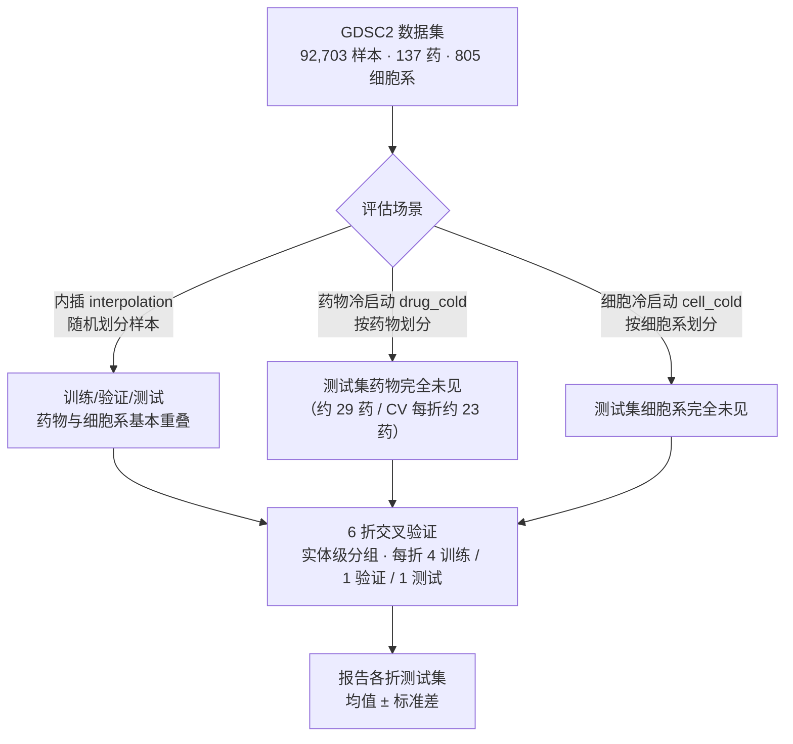
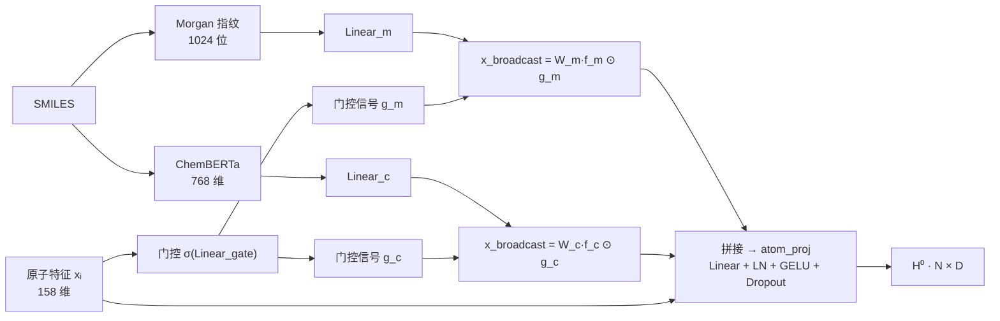
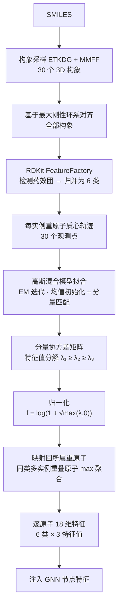
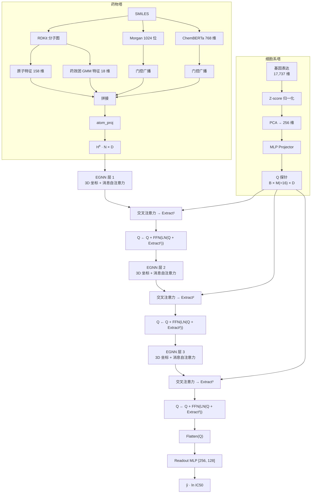

# 基于原子级预训练特征注入与高斯混合模型药效团模态的细胞系药物响应预测

---

## 摘要

### 背景

药物反应预测是实现精准医疗的重要手段，能够为患者个体筛选有效而副作用小的药物。尽管已经有许多方案用于增强CDR模型的药物刻画能力，但它们并未引入方法刻画分子构象的重要作用，并且仍然可以通过改进算法架构的方式提高性能。

### 结果

本研究提出了一种基于双塔结构的融合了高斯混合模型的多模态图注意力网络（protoGDA），该方法通过引入高斯混合模型来描述药效团在空间中的分布，并调整了双塔架构和迁移学习特征的引入方式，以提升药物预测反应的准确性。使用GDSC2数据，在多种场景下对protoGDA进行评估以验证该模型的性能，并证明其在药物冷启动场景中的显著优势。

### 结论

实验证明，调整迁移学习特征的引入方式和高斯混合模型的引入能够显著提高CDR模型的药物反应预测能力。我们对比了多种GNN架构，并给出最佳GNN架构为自注意力增强的EGNN。我们还通过实验验证，细胞系数据即使不经过自注意力层，也可以保持相应性能。该思路为设计构建更加高效准确的CDR模型提供了有效的借鉴方案，并提示了引入GMM以及更多有效特征的框架构建思路。

### 关键词

药物反应预测，迁移学习，高斯混合模型，肿瘤与癌细胞系，精准医疗，图神经网络

## 一、引言

​	肿瘤是重要的全球性公共卫生问题。其中，采用药物治疗（即化疗）已经成为标准的癌症治疗范式。但是，由于肿瘤的异质性和长期使用同种药物导致的耐药性，加之过往化疗药物具有往往具有较高的毒性，因而毒性小的、有针对性的化疗药物的需求仍然十分迫切。为了筛选有希望成为化疗药物的分子，以癌细胞系作为响应平台进行药物筛选被广泛采用，并被证明有效。尽管如此，对于广泛的分子和化学空间，采用湿实验方法，实际测量每种化合物对数百种不同亚型的癌细胞系的响应仍然成本不菲而且耗时漫长。因此，采用深度学习模型预测癌细胞系对候选分子的响应成为有效的初筛方案。

​	细胞系药物响应任务（CDR）正是对上述问题的直接建模：给定药物分子与癌细胞系，预测药物对细胞系的药效响应。而除此外，在计算药学领域还存在一个与CDR十分相关的方向——药物靶点相互作用（DTI），即预测药物分子与靶蛋白在分子层面的结合。化学原理上，DTI 是 CDR 的上游建模，药物往往通过与靶蛋白结合、干扰信号通路，进而抑制细胞系的生长。然而，二者的建模复杂度并不对等：CDR 任务背后的潜变量更多，细胞系响应除药-靶结合外，还受基因表达、突变、微环境等多因素共同作用，且药物发挥作用也并非总能被 DTI 确认（如脱靶效应、多靶点作用等）。尽管如此，二者始终是对相关问题在不同层面上的建模~~——CDR 刻画细胞表型层的响应，DTI 刻画分子结合层的相互作用——~~，它们共享药物侧表征与交互建模方法，因而可以在方法上充分交流借鉴。

​	目前在细胞系药物响应任务（CDR）中，采用药物-细胞系双塔模型进行训练逐渐成为主流架构，而图神经网络（GNN）在药物侧的使用被证明能够产生十分显著的性能提升。除此外，在每层训练后使用交叉注意力也可以有效地提升预测性能，这被认为是由于交叉注意力可以显著地刻画药物和细胞系对彼此的局部特征的针对性的关联。同时，为了评估CDR模型的性能，往往采用三种测试场景，分别为内插、细胞系冷启动和药物冷启动。其中，目前的模型在内插场景下能做到0.93~0.95的预测精度（此处应有引用）。在这样的结果下，预测结果已经接近噪声上限，除了提高数据质量和数量以外，理论上很难再进行显著的模型精度提升（此处也应当有引用）。而对于细胞系冷启动场景，实验证明各种模型在此场景下的预测仍然能保持较好的预测性能，这可能是因为细胞系特征空间分布和性质的相关性较好。但是，对于药物冷启动场景，大多数模型都会在此场景下产生显著倒退。因而，模型侧的建模目标应当侧重于在保持内插和细胞系冷启动场景下的预测能力的同时，尽可能提高在药物冷启动场景下的预测能力。

​	为了提高CDR模型对分子性质的理解，多种方案已经被引入。有研究通过辅助学习策略，让模型学会区分不同分子的化学性质，进而在此基础上提高对细胞系毒性的预测能力。有研究通过迁移学习策略，即引入在广阔化学空间上训练的预训练模型的输出结果，作为CDR模型药物侧的特征输入来提升对药物性质的刻画。但是，这些方法存在一些问题，首先，辅助学习对训练数据和计算资源的要求很高。迁移学习策略很好地解决了这一点，不过在目前引入GNN的架构中，迁移特征往往在离开GNN后才与GNN结果进行拼接融合，而没有得到充分的利用。其次，这些方法没有对药物构象特征进行显式采样刻画，而从第一性原理出发，构象同样是判断药物药效的重要依据。而在DTI领域的研究中，研究者开始使用多构象采样与共同决策的方式实现对药物构象的全面考虑。不过，多构象分析方法相应带来了显著提升的计算开销。

​	高斯混合模型（Gaussian Mixture Model，GMM）是一种以有限个高斯分量的加权和逼近任意复杂连续分布的参数化概率模型，其概率密度可表示为 $\Pr(\mathbf{x})=\sum_{k=1}^{K}\pi_k\mathcal{N}(\mathbf{x};\boldsymbol{\mu}_k,\boldsymbol{\Sigma}_k)$，其中 $\pi_k$、$\boldsymbol{\mu}_k$ 与 $\boldsymbol{\Sigma}_k$ 分别为第 $k$ 个分量的混合权重、均值向量与协方差矩阵。借助期望最大化（EM）算法，GMM 可在无类别标注的条件下高效估计参数，并以紧凑形式刻画多模态、各向异性的分布形态，因此被广泛用于各类连续数据的密度建模。在分子建模与药物设计领域，GMM 同样已有丰富应用，例如以多个高斯分量表征分子构象集合在构象空间中的占有率分布，或以高斯函数的叠加近似分子的电子密度与空间位阻信息（此处应有引用）。与显式枚举多构象并逐一前向计算的方式相比，GMM 仅需少量参数即可描述构象空间的整体形态，且对分量协方差矩阵做特征值分解后得到的特征值天然具有旋转不变性，能以标量形式刻画位点在各个方向上的伸展程度，几乎不引入额外计算开销。这些性质使得 GMM 成为多构象显式建模的一种轻量级替代方案，也为在分子表征中引入构象层面的柔性信息提供了可行的途径。

​	以此为灵感，本研究提出两个针对性的改进方案。其一是改变预训练模型结果的引入位置，我们可以训练一个自注意力方法，让每个原子从预训练模型给出的分子特征向量中提取不同的特征作为自己的原子特征，随后送入GNN中进行训练。其二是引入高斯混合模型作为多构象训练的替代方案，通过在训练前进行预处理，从药物分子中选取药效团并采构象，对齐后对协方差矩阵进行特征值分解，并将特征值作为原子级特征输入药物特征向量中。通过高斯混合模型的引入，我们能够使用微小的特征维度增加来刻画不同构象对药效的贡献。最终，在保证了内插和细胞系冷启动场景下持平或优于现有模型的基础上，在药物冷启动场景中取得显著的性能提升。

---

## 二、数据与预处理

### 2.1 数据集

本工作使用 Therapeutics Data Commons（TDC）平台提供的 **GDSC2** 数据集，包含 **92,703** 个药物–细胞系响应样本，覆盖 **137** 种药物与 **805** 种癌细胞系，标签为半数抑制浓度的自然对数（ln IC50）。药物侧与细胞系侧的唯一基础输入分别为 SMILES 分子结构与基因表达谱。

### 2.2 细胞系侧预处理

细胞系侧输入为 **17,737** 维 RMA 归一化基因表达谱。为避免数据泄漏，我们仅使用**训练集细胞系**拟合 Z-score 归一化与主成分分析（PCA），随后将全部细胞系投影到 **256** 维空间，作为模型的实际输入特征。

### 2.3 药物侧预处理

首先使用 RDKit 将 SMILES 解析为显式加氢的分子图，每个原子编码为 **158** 维特征（原子序数、度、形式电荷、手性、氢原子数、杂化方式、芳香性等 144 维基础特征以及氢键供体/受体、杂环、羰基、嘌呤/嘧啶骨架等 14 维扩展特征），每条化学键编码为 **6** 维特征（键型、共轭、成环）。构象敏感的模型变体（如 EGNN）额外加载 3D 构象。接着使用药物语言模型 ChemBERTa 为每个 SMILES 生成 **768** 维嵌入，以及计算 **Morgan 圆形指纹**（ECFP，半径 2，**1024** 位）。同时，筛选药效团并构建高斯混合模型信息，对每个药物采样 **30** 个 3D 构象（进行ETKDG嵌入与MMFF力场优化），然后基于最大刚性环系对齐全部构象以避免旋转带来的分布差异，随后用 RDKit FeatureFactory 检测药效团并归并为 **6** 类（氢键供体、氢键受体、芳香环、疏水、正电、负电）。对每一类药效团，将药物中的药效团实例在 30 个构象中的重原子质心轨迹作为观测点，拟合**高斯混合模型**，对每个分量的协方差矩阵做特征值分解，经 $f = \log(1+\sqrt{\max(\lambda,0)})$ 归一化后映射回所属重原子，同类多实例重叠原子按 max 聚合，最终得到逐原子的 **18** 维特征（6 类 × 3 个特征值）。

### 2.4 数据划分

我们将在三种评估场景下对本架构进行测试。其中每种场景下均按照随机种子 42 划分训练集、验证集和测试集：

- **内插（interpolation）**：随机划分样本，训练/验证/测试集中药物与细胞系基本重叠；
- **药物冷启动（drug_cold）**：按药物种类随机划分，测试集药物完全未在训练中出现（约 29 个测试药物）；
- **细胞冷启动（cell_cold）**：按细胞系种类随机划分，测试集细胞系完全未在训练中出现。

需要注意的是，正式评估协议为 6 折交叉验证。对每个场景，按药物（drug_cold）或细胞系（cell_cold）或样本（interpolation）分组做实体级 6 折，每折以 4 折训练、1 折验证、1 折测试，报告各折测试集的均值 ± 标准差。7:1:2 单次划分仅用于部分消融实验的内部同口径对比（6.2–6.5，见第六节）。

**图 1.** 数据划分与评估协议示意。三种场景下均采用实体级 6 折交叉验证，7:1:2 单次划分仅用于部分消融实验（6.2–6.5）内部同口径对比。

---

## 三、问题公式化

### 3.1 任务定义

给定药物分子 $d$ 与癌细胞系 $c$，预测其响应值 $\hat{y} \in \mathbb{R}$（对数 IC50）。记药物图 $\mathcal{G}_d = (\mathcal{V}, \mathcal{E})$，其中节点 $v_i \in \mathcal{V}$ 为原子、边 $e_{ij} \in \mathcal{E}$ 为化学键；细胞系特征向量为 $\mathbf{f}_c \in \mathbb{R}^{256}$。目标是构建一个深度学习网络，通过d与c预测响应值$\hat{y}$：（给出公式表示）

### 3.2 整体建模框架

模型采用**双塔 + 逐层交叉注意力**框架。细胞系塔将 $\mathbf{f}_c$ 投影为一组 $M$ 个可学习的"探针"查询 $\mathbf{Q} \in \mathbb{R}^{M \times D}$；药物塔经 GNN 逐层演化原子特征 $\mathbf{H}^{(l)}$。在每一层，探针以单向交叉注意力从当前药物图节点中提取与细胞相关的信息，并沿层累积；最终以累积后的探针表示预测响应：$$Q^{(l+1)} = Q^{(l)} + \text{FFN}\big(\text{LN}(Q^{(l)} + \text{Extract}^{(l)})\big),$$

~~$$\hat{y} = \text{Readout}\big(\text{Flatten}(Q^{(L)})\big).$$~~

~~其中残差式交互是本工作的实际训练范式（探针累积记忆模式未通过消融验证，故不使用）。~~

### 3.3 交叉注意力提取

每一层中，探针 $\mathbf{Q}$ 查询当前药物图节点特征 $\mathbf{H}^{(l)}$：

$$\mathbf{Q} = \text{Linear}_Q(\mathbf{Q}),\quad \mathbf{K} = \text{Linear}_K(\mathbf{H}^{(l)}),\quad \mathbf{V} = \text{Linear}_V(\mathbf{H}^{(l)}),$$

$$\text{Attn}(\mathbf{Q}_i, \mathbf{K}_i, \mathbf{V}_i) = \text{softmax}\!\left(\frac{\mathbf{Q}_i \mathbf{K}_i^\top}{\sqrt{d_h}}\right) \mathbf{V}_i,$$

其中下标 $i$ 表示逐样本计算（各分子原子数不同，采用 padded batched 注意力）。输出维度仅由探针数 $M$ 与隐藏维度 $D$ 决定，与分子大小无关。

### 3.4 原子级预训练特征注入（创新点之一）

区别于"将预训练向量拼接在 GNN 输出后"的常见做法，我们训练一个**原子感知的门控机制**，让每个原子从药物级预训练特征中提取属于自己的子信息：

$$\mathbf{g}_{\text{m}} = \sigma(\text{Linear}_{\text{gate}}(\mathbf{x}_{\text{atom}})),$$

$$\mathbf{x}^{\text{broadcast}}_i = \mathbf{W}_{\text{m}}(\mathbf{f}_{\text{morgan}}) \odot \mathbf{g}_{\text{m}}(\mathbf{x}_i),$$

其中 $\mathbf{x}_i$ 为原子 $i$ 的 158 维特征，$\mathbf{f}_{\text{morgan}}$ 为药物级 Morgan 向量，$\odot$ 为逐元素乘。ChemBERTa 向量以相同方式注入。该机制使不同化学环境的原子从同一药物级向量中"抽取"不同信息，随后与原子特征拼接送入投影层，使预训练信息真正进入图内消息传递，而非仅在末端拼接。

**图 2.** 原子级预训练特征注入。每个原子通过门控信号从药物级 Morgan / ChemBERTa 向量中抽取个性化子空间特征，再与原子特征拼接送入投影层。

### 3.5 高斯混合模型药效团模态（创新点之二）

设第 $k$ 个药效团实例在 $C=30$ 个对齐构象中的重原子质心坐标为 $\{\mathbf{p}_k^{(1)}, \dots, \mathbf{p}_k^{(C)}\} \subset \mathbb{R}^3$。对同一类药效团的所有实例，拟合高斯混合模型：

$$\Pr(\mathbf{p}) = \sum_{k=1}^{K} \pi_k\, \mathcal{N}(\mathbf{p}; \boldsymbol{\mu}_k, \boldsymbol{\Sigma}_k),$$

EM 迭代求解各分量均值 $\boldsymbol{\mu}_k$ 与协方差 $\boldsymbol{\Sigma}_k$（以各实例参考质心初始化均值，并用最近初始化均值匹配避免 EM 重排序）。对每个分量协方差做特征值分解 $\boldsymbol{\Sigma}_k = \mathbf{U}_k \text{diag}(\lambda_{k1},\lambda_{k2},\lambda_{k3}) \mathbf{U}_k^\top$，取特征值并归一化：

$$\mathbf{g}_k = \log\big(1 + \sqrt{\max(\lambda_{k1}, 0)}\big),\ \log\big(1 + \sqrt{\max(\lambda_{k2}, 0)}\big),\ \log\big(1 + \sqrt{\max(\lambda_{k3}, 0)}\big).$$

特征值刻画了该药效团位点在构象空间中的柔性/展开程度（刚性环系特征值小，柔性侧链特征值大），以旋转不变的标量形式逐原子注入节点特征，在不破坏图网络等变性质的前提下，用微小维度代价（6 类 × 3 = 18 维）编码多构象信息。

**图 3.** 药效团 GMM 模态预计算管线。从 SMILES 出发经构象采样、对齐、药效团检测、GMM 拟合与特征值分解，得到逐原子的 18 维柔性特征。

---

## 四、方法

### 4.1 总体架构
如图展示了我们的模型架构。预处理后的细胞系数据和药物数据分别送入两侧的塔中，其中细胞系数据以在经过线性变换后生成一个静态的探针张量。而药物数据则在经过拼接融合后与探针张量进行交叉注意力（药物接受细胞系的查询），然后进入GNN中挖掘药物的深层化学信息，如此重复三次。在最后一次离开GNN时，探针张量会再次进行交叉注意力。随后，将探针函数送入连接层，得到最后的预测结果。

**图 4.** 整体模型架构。细胞系塔将基因表达谱投影为 $M=16$ 个探针查询 $\mathbf{Q}$；药物塔经 **EGNN**（等变图神经网络，含 3D 坐标演化与基于不变量的消息自注意力）逐层演化原子特征（融合门控广播的预训练特征与药效团 GMM 特征）；每层探针以交叉注意力提取药物信息并以残差方式更新，最终展平送入读出 MLP 预测 $\ln$ IC50。

### 4.2 细胞系塔（探针投影）

基因表达向量经 MLP（LayerNorm / GELU / Dropout）与一组可学习探针偏置，投影为 $\mathbf{Q} \in \mathbb{R}^{B \times M \times D}$。我们共计使用 $M=16$ 个探针，用于拟合不同的生物学通路偏好。$\mathbf{Q}$ 投影后将跨层复用，并且不进行细胞塔内部的逐层训练。我们通过消融实验验证了这一设计的合理性（见 6.5）。~~：在层间对探针叠加自注意力 + FFN 的塔内训练块在三个场景下均无增益（Δ ∈ [-0.003, -0.010]），故保持静态塔作为最终配置。~~

### 4.3 药物塔（图演化）

原子特征（158 维）与原子级门控广播后的 Morgan/ChemBERTa 特征（各 32 维）以及药效团 GMM 特征（18 维）拼接，经 `atom_proj`（Linear + LayerNorm + GELU + Dropout）投影到隐藏维 $D$。每层使用 **EGNN**（等变图神经网络）卷积：消息传递同时更新隐藏特征 $\mathbf{h}$ 与 3D 坐标 $\mathbf{x}$（键长/角度等旋转不变距离信息经饱和 RBF 编码），并在消息聚合中加入**基于不变量的自注意力**（softmax 邻居加权，保持 E(n) 等变性），经 LayerNorm / GELU / Dropout / 残差连接演化节点特征。我们通过消融验证了 EGNN + 自注意力在充分训练（60 epoch 6 折 CV）下显著优于无注意力版本（drug_cold 0.531 vs 0.456，见 6.1）。

### 4.4 逐层交叉注意力与残差交互

在每一层，探针 $\mathbf{Q}$ 对演化后的药物图节点做单向多头交叉注意力提取 $\text{Extract}^{(l)}$，随后以残差方式更新探针：$Q^{(l+1)} = Q^{(l)} + \text{FFN}(\text{LN}(Q^{(l)} + \text{Extract}^{(l)}))$。经过全部 $L=3$ 层后，将探针展平送入读出 MLP（隐藏层 [256, 128]）输出预测。

### 4.5 训练细节

Adam 优化器，初始学习率 $10^{-4}$，权重衰减 $10^{-4}$，学习率预热 5 轮 + ReduceLROnPlateau 调度，批大小 1280，均方误差损失。为缓解药物冷启动下对训练药物的记忆，药物侧启用强正则化（原子投影 Dropout 0.3、Morgan/ChemBERTa 投影高斯噪声 $\sigma=0.3$）。

---

## 五、结果

### 5.1 总体对比

下表汇总各模型在三种场景下的测试集表现（Pearson 相关系数 / RMSE）。除特别标注外，所有模型均按统一的 6 折交叉验证协议评估；MGATAF 文献为原论文报告值。

| 模型 | 内插 Pearson | 内插 RMSE | 细胞冷启动 Pearson | 药物冷启动 Pearson | 药物冷启动 RMSE |
|------|:---:|:---:|:---:|:---:|:---:|
| CANDELA（CV） | 0.8945 ± 0.0039 | 1.2184 ± 0.0183 | 0.8372 ± 0.0209 | 0.3321 ± 0.0572 | 2.6114 ± 0.4003 |
| MGATAF（CV） | 0.8278 ± 0.0024 | 1.5275 ± 0.0091 | 0.8152 ± 0.0053 | 0.4151 ± 0.2059 | 2.5037 ± 0.3326 |
| MGATAF（文献） | 0.9312 | 0.0225† | 0.8536 | — | — |
| **CellQuery (EGNN + 自注意力 + GMM, 本文)（CV）** | **0.9344 ± 0.0016** | **0.9743 ± 0.0122** | **0.8735 ± 0.0036** | **0.5306 ± 0.1458** | **2.2521 ± 0.2426** |

除标注外，全部数值为 **6 折交叉验证的均值 ± 标准差**（每折测试集为独立药物/细胞系分组，统一轮数口径：drug_cold 60 / cell_cold 100 / interpolation 200 epoch），后续正文数值均以此为口径。

† 文献 RMSE 基于归一化标签，仅作趋势参考。
" — " 表示未运行/未报告。

> 注：CANDELA / MGATAF 为忠实复现的公开基线（GATv2 图编码、多通道注意力等），图特征为文献规定的 78 维原子特征；CellQuery 各行为本工作同口径 CV 实测结果。CV 每折训练数据少于单次满数据训练（drug_cold 每折约 92 药），故 CV 数值普遍低于单次结果，属于正常的口径差异，所有模型在同一 CV 协议下比较。

### 5.2 柱状图

**图 5.** 各模型在三种评估场景下的 CV Pearson 相关系数（均值 ± 标准差）。本工作模型（EGNN + 自注意力 + GMM 药效团）在内插、细胞冷启动与药物冷启动三个场景均领先全部 CV 基线。

### 5.3 关键发现

1. **内插场景**：本工作（0.9344 ± 0.0016）达到该数据集的合理性能上限，与文献最优水平（MGATAF 文献值 0.9312）持平；在 CV 同口径下显著超过 CANDELA（0.8945，+0.040）与 MGATAF（0.8278，+0.107）。
2. **细胞冷启动**：所有模型表现稳健（0.81–0.88），本工作（0.8735 ± 0.0036）最优，超过 CANDELA（0.8372，+0.036）与 MGATAF（0.8152，+0.058）。
3. **药物冷启动（核心贡献）**：本工作以 0.5306 ± 0.1458 的 CV Pearson 显著超过 CANDELA（0.3321，**+0.199**）与 MGATAF（0.4151，**+0.116**），RMSE 也由 CANDELA 的 2.6114 与 MGATAF 的 2.5037 降至 2.2521。这验证了"以 GMM 刻画构象空间药物柔性"对未见药物泛化的价值。drug_cold 场景下各模型方差均较大（CV 每折测试集仅约 23 药），本工作的优势体现在均值与稳定领先方向上。

---

## 六、消融实验

全部消融中，6.1 的 GNN 承载架构消融采用与第五章正式结果**完全同口径的 drug_cold 60 epoch、6 折交叉验证协议**（实体级分组、每折 4 训练 / 1 验证 / 1 测试、报告各折测试集 Pearson 均值 ± 标准差），保证与 5.1 表直接可比；6.2–6.5 的其余消融沿用早期 25 epoch 单次口径（早停 patience=50）用于同口径内部对比，两者绝对值不可直接比较。

### 6.1 不同 GNN 承载架构 × 药效团模态

以无药效团的 GAT 作为参照锚点（该配置为主表 5.1 移除药效团模态后的变体），对比不同 GNN 架构承载药效团（GMM）模态在 drug_cold（60ep 6 折 CV）的表现：

| GNN 类型 | 无药效团 | + 药效团（GMM） |
|---|:---:|:---:|
| GAT（无 edge_attr） | 0.506 ± 0.178 | 0.436 ± 0.258 |
| GINE（含 edge_attr） | 0.496 ± 0.169 | 0.512 ± 0.176 |
| EGNN（含 3D 坐标，无自注意力） | 0.497 ± 0.156 | 0.507 ± 0.178 |
| **EGNN（含 3D 坐标，+ 自注意力）** | — | **0.531 ± 0.146** |

> 表内为 drug_cold 60ep 6 折 CV 的测试集 Pearson 均值 ± 标准差（各折测试集仅 23 药，单折波动大）。GAT 无药效团在三个场景下的早期单次完整训练结果为：内插 0.9330（RMSE 0.9914）、细胞冷启动 0.8643、药物冷启动 0.6552（RMSE 2.1053），作为历史锚点记录于 results.md。EGNN + 自注意力且无药效团的组合未单独运行——自注意力与药效团为相互独立的配置开关（`egnn_use_attention` / `use_pharmacophore`），本表如实报告正式采用的组合（见 4.3）。

**分析**：药效团特征对承载架构高度敏感。GAT 携带药效团显著受损（0.506→0.436，**-0.070**）：其注意力路由缺少 3D/键合语境，把药效团稀疏非零模式误当成"原子身份"信号。GINE（显式利用键特征、sum 聚合）使药效团转为正贡献（0.496→0.512，**+0.016**）。EGNN 无自注意力时药效团贡献微弱（0.497→0.507，**+0.009**）；但**加入消息内自注意力后跃升至全部配置最高（0.531）**——自注意力为 3D 消息传递引入可学习的邻居加权，使 EGNN 能更精准地消费药效团柔性特征。这一发现与早期 25ep 单次口径（自注意力 0.5637 vs 无 0.6422，看似更差）相反，原因是 60ep 完整训练让自注意力机制充分收敛（详见 results.md 中 2026-08-11 实验记录）。**承载架构与消息注意力是决定药效团模态能否发挥作用的先决条件**，这也是我们将 EGNN + 自注意力作为基底的原因。

### 6.2 高斯混合模型 vs 经验协方差

| 协方差估计方式 | drug_cold Pearson |
|---|:---:|
| 每实例经验协方差 | 0.684 |
| **GMM（EM 拟合分量协方差）** | **0.6894** |

**分析**：GMM 与经验协方差性能相当（差异 0.005，处于 drug_cold 噪声范围内）。数值上，对实例稀疏的家族二者几乎一致；对实例密集家族（如疏水类 K=17），EM 的软分配会产生更"池化"的协方差估计。经验协方差可视为组件分配固定时 GMM 分量的极大似然特例，因此二者信息等价。本文以 GMM 为正式实现（与创新点叙事一致），经验协方差作为消融证明模型对协方差估计方式稳健。

### 6.3 药效团特征引入方式

| 引入方式 | drug_cold Pearson |
|---|:---:|
| 拼接进原子特征（默认） | 0.458 |
| 残差注入（绕过 LayerNorm） | 0.307 |
| 残差注入 + GAT 键特征语境 | 0.518 |

**分析**：对 GAT 而言，将药效团原始尺度特征（[0,2.3]）以残差方式绕过共享 LayerNorm 直接注入反而更差（0.307），说明 LayerNorm 的标准化是必要的；补充键特征语境（edge_attr）后显著回升（0.518），但 GAT 的边特征只参与注意力 logit 而不改消息内容，仍不及图同构网络（GINE）的边特征注入消息 + sum 聚合（0.689）。这一结论连同 6.1 的 EGNN + 自注意力结果，共同支持基底选择承载架构能够正确消费药效团特征的 EGNN + 自注意力。

### 6.4 预训练特征引入位置

由于 gated 原子级广播自项目基线起即为默认设计，此处以基线（GAT 无药效团，drug_cold 0.655 / 内插 0.933）作为参考锚点：在移除药效团模态后，模型仅依赖原子级门控广播的 Morgan/ChemBERTa 与图拓扑即达到与文献内插上限持平的成绩；引入药效团 GMM 模态后，在最终基底（EGNN + 自注意力）承载下于药物冷启动再获提升（CV 0.456→0.531，+0.075，含自注意力增益）。预训练特征的"拼接式末端融合 vs 原子级门控广播"的显式对比留作后续工作。

### 6.5 细胞塔是否需要内部训练

本工作细胞塔的默认设计是**静态的一次性投影**：基因表达向量经 `CellQueryProjector` 投影为 $M$ 个探针查询 $\mathbf{Q}$ 后，$\mathbf{Q}$ 仅在后续各层通过交叉注意力提取的信息 + 残差 FFN 更新，不再做细胞塔内部的逐层训练。为验证这一设计选择，我们在每层交叉注意力之前对探针施加 **塔内训练块**（`CellTowerBlock`：Pre-LN 残差结构，探针自注意力 + FFN，3 层、8 头），观察是否提升效果：

| 场景 | 无塔内（基底，单次口径） | + 塔内训练 | Δ |
|------|:---:|:---:|:---:|
| drug_cold（25ep） | **0.6894** | 0.6789 | -0.010 |
| interpolation（200ep） | **0.9333** | 0.9305 | -0.003 |
| cell_cold（100ep） | **0.8639** | 0.8548 | -0.009 |

> 该消融在基底架构上运行（当时为 GINE+GMM，25ep 单次口径）。塔内训练与承载架构正交：其无增益的结论是架构无关的（塔内块只作用于细胞侧探针，不触碰药物塔演化），因此对换用 EGNN+自注意力后的最终配置同样成立。

**分析**：塔内训练在三个场景下均无增益（Δ ∈ [-0.003, -0.010]，略差）。这表明细胞塔的静态一次性投影已经足够——探针 $\mathbf{Q}$ 的跨层更新完全由交叉注意力提取的药物信息驱动（残差 FFN 已提供充分的逐层演化），额外在细胞塔内部叠加自注意力与更深的前馈网络既未增强细胞表征，也未改善跨模态交互，反而引入多余参数与计算开销。模型的瓶颈在药物侧（药物冷启动需靠药物侧正则化缓解记忆，见 4.5），而非细胞塔容量。因此**默认保持静态塔**（`cell_tower_interleaved: false`），不纳入基线。

---

## 七、讨论

本文围绕细胞系药物响应预测中**药物冷启动泛化难**这一核心问题，提出两项改进并以系统实验验证：

1. **原子级预训练特征注入**：让每个原子通过门控机制从药物级预训练向量中提取个性化子空间特征，使 ChemBERTa/Morgan 信息真正参与图内消息传递，而非末端拼接。

2. **高斯混合模型药效团模态**：以 30 个构象的采样与对齐，将药效团位点在构象空间的柔性以 GMM 分量协方差特征值的形式逐原子编码，用 18 维的微小代价替代昂贵的多构象显式建模。

实验结论：

- 在**内插**（CV Pearson 0.9344）与**细胞冷启动**（0.8735）场景，本工作均领先全部 CV 基线（CANDELA 0.8945 / 0.8372，MGATAF 0.8278 / 0.8152），且与文献最优水平持平或略优；
- 在**药物冷启动**场景，本工作（CV 0.5306）显著优于全部复现基线（CANDELA 0.3321，+0.199；MGATAF 0.4151，+0.116），RMSE 同步下降；
- 消融表明，**承载架构（EGNN + 自注意力）与特征引入方式**是药效团模态能否发挥价值的关键（消融见第六节）；GMM 与经验协方差性能相当，印证了以 GMM 形式呈现多构象信息的合理性。
- **充分训练是注意力机制发挥作用的必要条件**：EGNN 消息内自注意力在 60 epoch 6 折 CV 下显著优于无注意力版本（drug_cold 0.531 vs 0.456，+0.075），而早期 25 epoch 单次口径下表现为更差——注意力参数多、收敛慢，短训练下能力无法展开。这一发现修正了"EGNN 自注意力无效"的早期结论。
- **细胞塔的静态设计是充分的**：在层间对探针叠加塔内训练块（自注意力 + FFN）在三个场景下均无增益（Δ ∈ [-0.003, -0.010]）。这印证了模型能力瓶颈在药物侧（药物冷启动的记忆化问题）而非细胞塔容量，也说明"双塔中细胞塔仅负责提供稳定的查询初始化、药物塔负责逐层信息演化"的架构分工是合理且高效的——我们无需为细胞塔引入额外的逐层训练复杂度。

局限与展望：药物冷启动 CV 各折测试集仅含约 23 个药物，单折 Pearson 方差较大（±0.06 ~ ±0.21），后续可采用按药物聚合的评估指标或更大的药物库（如 GDSC1/CCLE 合并）以增强结论稳健性；多构象显式聚合可作为对比实验纳入；预训练特征的原子级门控广播与末端拼接的显式消融亦值得进一步量化。

---

## 八、代码可用性

本工作全部代码将在 GitHub 上以开源形式发布，包含：完整的数据预处理与药效团 GMM 预计算管线（含构象采样、对齐、特征提取）、模型实现（EGNN/GINE/GAT 可切换）、三种数据划分场景的训练与评估脚本、可复现实验结果的默认配置，以及注意力权重的可视化工具。仓库将提供一键复现本文全部表格与图表的命令。
